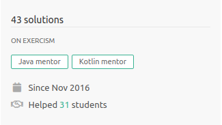

### Juan Vega (He/Him)

I am a product-focused Software Engineer that believes that a key element for a software product to success is technical excellence that among other things, it includes: pragmatism, good communication skills, deep understanding of business problems, and well-sized solution.

[Read more...](https://juandavidvega.es)

I am not a major contributor, but I always try to put my two cents on projects that I like. Remember to check [my code contribution on github](https://github.com/pulls?q=is%3Apr+author%3Ajdvr+archived%3Afalse+is%3Aclosed+is%3Apublic). For my last projects I have been using gitlab, so check also [jdvr on gitlab](https://gitlab.com/jdvr)

Aside from existing repositories here, I have submitted more than 40+ well-known code exercises solution to [excercism.io](https://exercism.io/), if you are considering me as a candidate it might worth the time to look at my [public exercism profile](https://exercism.io/profiles/jdvr).

:computer: [Blog](https://juandavidvega.es) :microphone: [Podcast (ES)](https://thebigbranchtheorypodcast.github.io/)
